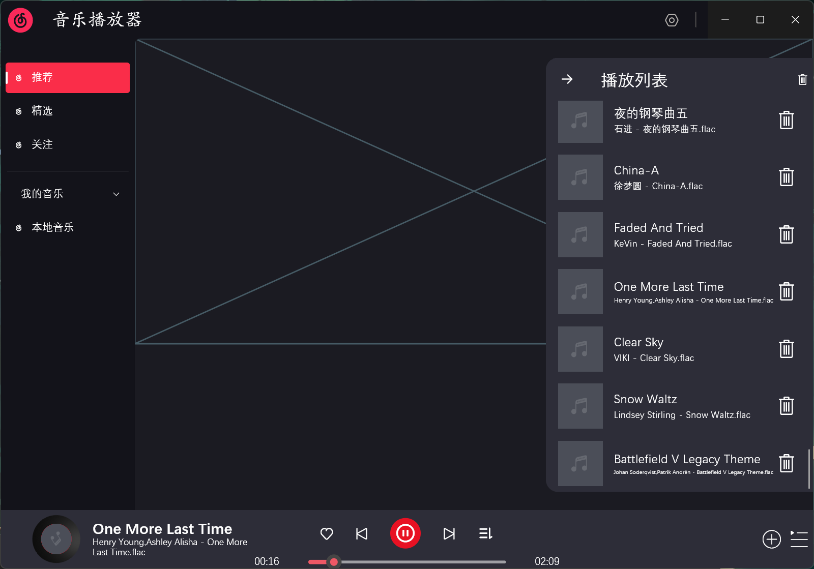

# netease_cloud_music

## 项目介绍
* 这是我在学习Flutter过程中的第一个练手项目，是一个基于网易云音乐的音乐播放器，仅支持 **Windows** 平台。
* 本项目仅供学习交流使用，如有侵权，请联系作者删除。
***

### 项目功能
|         功能项         | 状态 |      备注       |
|:-------------------:|:--:|:-------------:|
|        本地播放         |    |     优先实现      |
|        在线播放         |    | 可能会实现，自身能力有限  |
|        设置页面         |    |               |
|   Windows SMTC集成    | √  | 插件有bug，无法完美支持 |
| 支持网易云Vip本地文件ncm解密播放 | √  | 有缺陷，会破坏封面元数据  |
> 解密功能参考了[ncm-decrypt](https://github.com/taurusxin/ncmdump)项目，感谢作者的开源。

#### 演示图片

##### 持久化数据对照
|    本地数据    | 网易云数据 |   类型   |
|:----------:|:-----:|:------:|
| sessionKey | 二维码ID | String |
|   userID   | 账户ID  |  int   |
